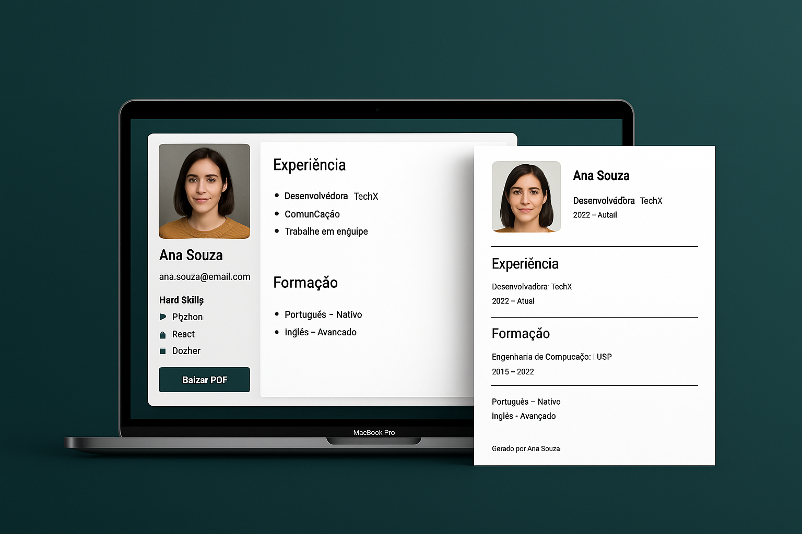
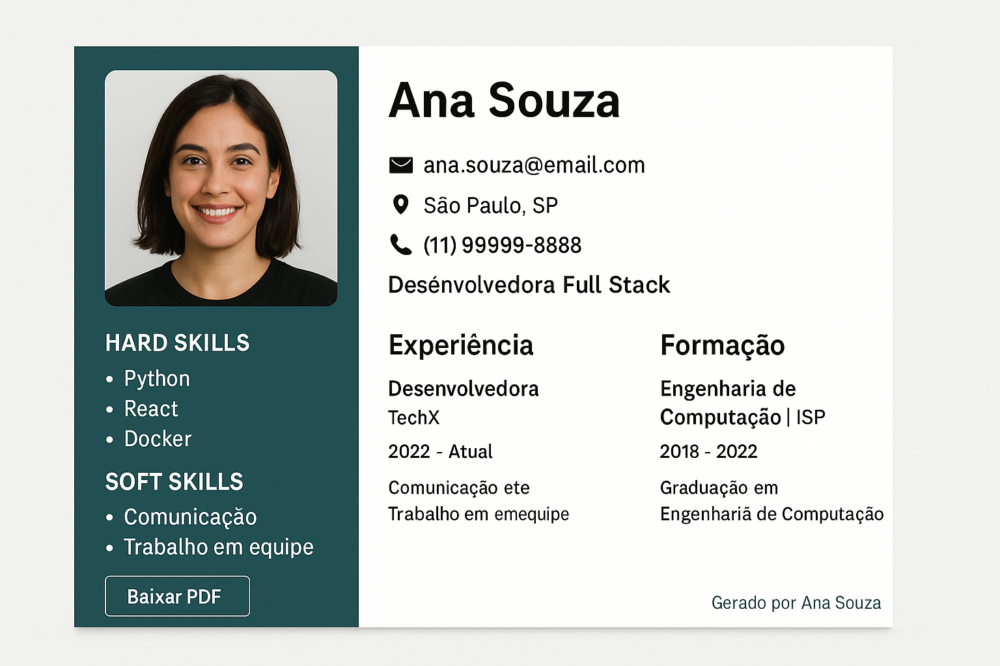

<p align="center">
  
</p>

# 🧐 Gerador de Currículos com IA

Crie currículos profissionais em **segundos**!  
Este projeto utiliza **Inteligência Artificial** para transformar textos, dados ou respostas simples em um currículo PDF elegante, pronto para uso.

---

## 📸 Preview Visual

| Interface Web | Currículo Gerado |
|:-------------:|:----------------:|
|  |  |

---

## 📄 Sobre o Projeto

O **Gerador de Currículos com IA** permite que qualquer pessoa crie rapidamente um currículo estilizado, apenas fornecendo seus dados, um texto descritivo ou respostas simples.

### 🔥 Funcionalidades

- ✅ Geração automática de currículos em PDF
- ✅ Layout profissional, limpo e responsivo
- ✅ Entrada via texto livre ou formulário manual
- ✅ Preenchimento inteligente com IA (OpenAI GPT)
- ✅ Download instantâneo do currículo (HTML → PDF) no navegador
- ✅ **Linhas divisórias pretas no PDF** para separar seções de forma elegante
- ✅ 100% web: sem necessidade de servidor ou backend

---

## 🚀 Em Desenvolvimento

💬 **Integração com Telegram e WhatsApp**  
Em breve, será possível gerar seu currículo apenas enviando uma mensagem no WhatsApp ou Telegram!

**Exemplo:**
> *"Olá, quero gerar meu currículo."*  
> A IA coleta seus dados e devolve o PDF diretamente no chat. ✔️

---

## 🏗️ Tecnologias Utilizadas

- 💻 **Front-End:** HTML, CSS, W3.CSS
- ⚙️ **Geração de PDF:** html2pdf.js (JavaScript puro)
- 🧠 **Inteligência Artificial:** OpenAI GPT (organização e distribuição dos dados)
- 🔗 **Futuro:** Integração com APIs do WhatsApp Business e Telegram Bot

---

## 🛠️ Como Rodar Localmente

1. Clone este repositório:
    ```bash
    git clone https://github.com/seu-usuario/gerador-curriculos-ia.git
    ```
2. Abra o arquivo `index.html` no navegador.
3. Preencha os dados no formulário ou insira um texto livre.
4. Clique em **"Baixar PDF"** para gerar seu currículo instantaneamente.

---

## 🎯 Demonstração

👉 [Acesse a Demo Online](https://seu-link-aqui.com)

---

## 💡 Próximos Passos

- [ ] Integração com WhatsApp e Telegram
- [ ] Templates de currículos personalizáveis
- [ ] Suporte multilíngue
- [ ] Exportação para outros formatos (DOCX, JSON)

---

## 🧠 Desenvolvido por

**Manoel Neto**  
🌟 IA Agent | Software Engineer | Cybersecurity Student  
🚀 [GitHub](https://github.com/eusoumanoelnetto)  
💼 [LinkedIn](https://www.linkedin.com/in/eusoumanoelnetto)

---

## ⚖️ Licença

Distribuído sob a licença MIT. Veja o arquivo `LICENSE` para mais detalhes.

---

## 🔥 Pitch Final

> Este não é apenas um gerador de currículos. É uma ferramenta de transformação digital, acessível, intuitiva e moderna, que em breve estará disponível diretamente nos seus apps favoritos como WhatsApp e Telegram.  
> **Simples. Inteligente. Poderoso.**

---

## 📢 Contribuições

Contribuições são bem-vindas! Se você tem uma ideia, correção ou melhoria, abra uma *issue* ou envie um *pull request*.